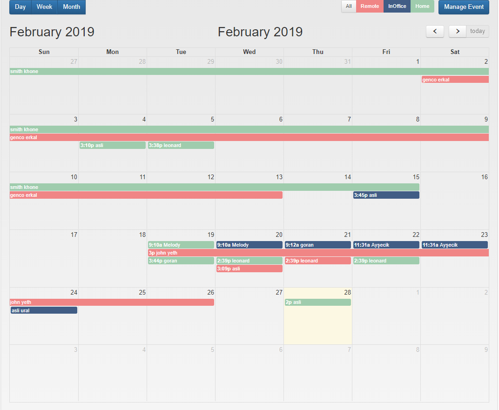
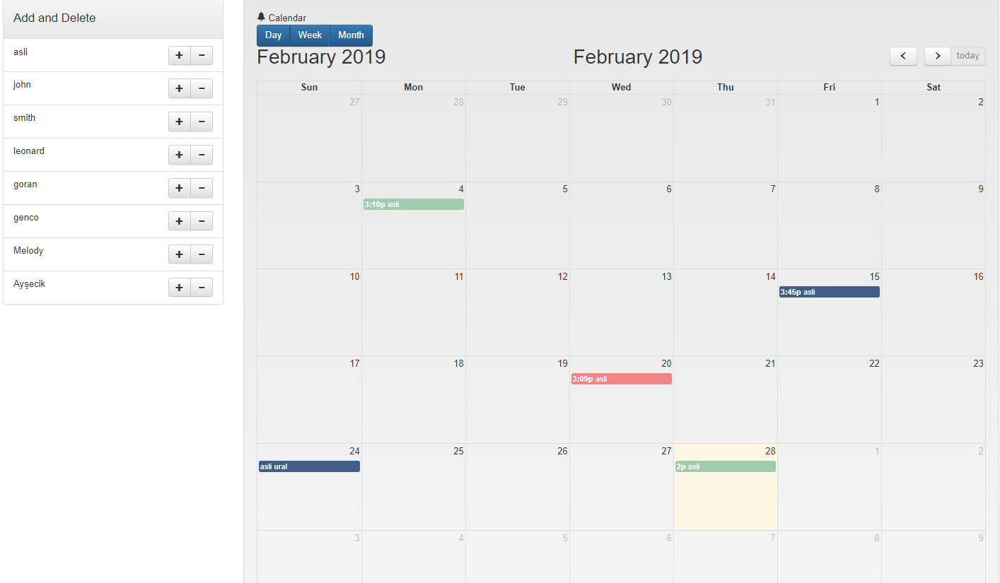
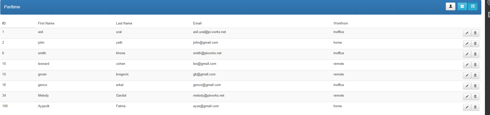
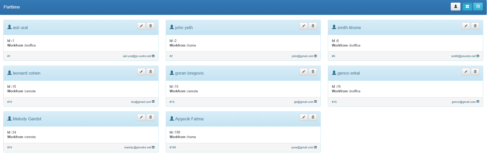
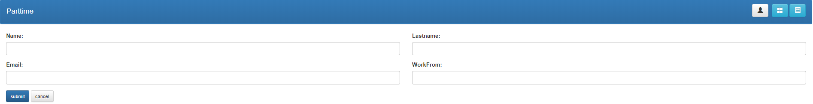

# :date: Parttime Calendar App 
*This project made for parttime.*
*The goal is more pratical use for planning days which are parttime's work-day.*

## Features:
- [x] All work-day and parttime save database in back-end and also they have a relation
- [x] Use ASP.NET MVC and Visual Studio 2017
- [x] Use MySQL Server as database back-end
- [x] CRUD operation used.All functions executed in relational database applications and mapped to a standard HTTP method, MySQL statement.
- [x] Use WebApi for Database and Controller  
- [x] Filtred by remote,inoffice and home attribute on calendar
- [x] Day,Week and Month view 
- [x] Filtred by parttime name
- [x] Add/Delete a parttime work-days one time on calendar
- [x] Add a work-day make use off datetime-picker
- [x] List and card view of parttime's attribute
- [x] Add a parttime on create page and create page controlled  wrong input
- [x] All buttons have a title and warning/success/error toastr
- [x] Delete buttons have a modal which is a warning about delete work-day/parttime

## DataBase MySQL Commands:
```sql sh
show databases
create database parttimedb
# generate parttime table
CREATE TABLE parttime
(
  id              INT unsigned NOT NULL AUTO_INCREMENT, # Unique ID for the record
  firstname            VARCHAR(150) NOT NULL,                
  lastname           VARCHAR(150) NOT NULL,                
  email           VARCHAR(150) NOT NULL,                        
 workfrom  VARCHAR(150) NOT NULL.
  PRIMARY KEY     (id)                                  # Make the id the primary key
);
#add a value to parttime table
insert into parttime (firstname, lastname, email,workfrom) VALUES
  ( 'asli', 'ural', 'asli.ural@piworks.net', 'inoffice');
#check the database after adding
  select * from parttime;

#Also we need events table because  parttime calendar’s events drop database.
#Use created database which is parttimedb
use parttimedb
# generate parttime table
CREATE TABLE events
(
  EventID             INT unsigned NOT NULL AUTO_INCREMENT, # Unique ID for the record
  Title            VARCHAR(150) NOT NULL,                
  Description           VARCHAR(150) NOT NULL,                
  StartAt          DATETIME NOT NULL,                        
 EndAt   DATETIME NOT NULL,
 IsFullDay   BIT NOT NULL,	
ParttimeId INT NOT NULL ,  # for parttime and events table connection when added on table its automatically get the id from parttime table
Work VARCHAR(150) NOT NULL,
  PRIMARY KEY     (EventID)                                  # Make the id the primary key
);
#add a value to events table
insert into events (Title, Description, StartAt, EndAt, IsFullDay, ParttimeId, Work) VALUES
  ( 'parttime', 'exam week', ' 2019-02-19 15:00:00 ', ' 2019-03-19 15:00:00 ',false, '10', 'inoffice');
#check the database after adding
  select * from events;

```
## Folder Structure:
```sh
Parttime-Calendar:.
|   .babelrc
|   .eslintrc.js
|   .gitignore
|   .hgignore
|   karma.conf.js
|   output.txt
|   package-lock.json
|   package.json
|   protractor.conf.js
|   README.md
|   webpack.config.js
|   
+---.vscode
|       launch.json
|       
+---dist
|       index.html
|       main-bundle.js
|       vendor-bundle.js
|       
+---img
|       CreateCalendarPage.PNG
|       CreatePage.PNG
|       HomePage.PNG
|       ParttimeCardView.PNG
|       ParttimePage.PNG
|       
+---src
|   |   app.config.js
|   |   app.js
|   |   index.ejs
|   |   
|   +---image
|   |       favicon.ico
|   |       
|   +---module
|   |   +---Home
|   |   |       CreateNewEvent.html
|   |   |       Home.html
|   |   |       HomeController.js
|   |   |       HomeService.js
|   |   |       PartCalendarController.js
|   |   |       
|   |   \---PartTime
|   |           Card.html
|   |           Create.html
|   |           PartTime.html
|   |           PartTimeController.js
|   |           PartTimeService.js
|   |           Table.html
|   |                    
|           
\---tests
    +---e2e
    |       Home-spec.Spec.js
    |       PartTime-spec.Spec.js
    |       
    \---unit
            Homecontroller-spec.Spec.js
            Homeservice-spec.Spec.js
            Parttimecomponent-spec.Spec.js
            
```


## Technologies:
###### Project is created with:
- Bootstrap 3.2.1 
- Jquery 3.3.1
- Angular 1.7.6 
- Angular-animate 1.7.7
- Webpack 4.29.0
- Calendar-ui
- Fullcalendar 3.10.0
- Toastr 2.1.4
- Jasmine 2.9.0
- Karma 2.9.0
- Eslint 5.13.0
- Protractor 5.4.2

## Installation:
###### All install example is npm if you are not use npm  please check.
- Clone the project
```sh
$ git clone https://github.com/AsliUral/PartTime-Calendar.git
```
- Project cloned your local and open directory
```sh
cd PartTime-Calendar
```
- Install dependencies
```sh
npm install
```
- Start webpack
```sh
npm run build
```


## Running the tests:
- Unit Test
```sh
npm run test
```
- E2E Test
```sh
npm run e2e
```

## Screenshot:
- Home Page

- Add/Delete work-day on calendar

- List of the parttime

- Card view of parttime

- Create a new parttime

